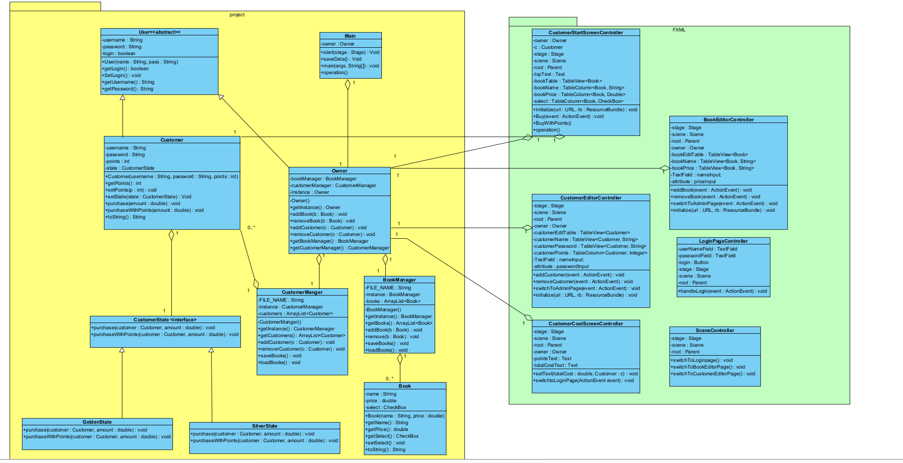

# Book Store Project

Full Stack Java Book Store

Admin
- Manages the inventory of the store.
- Can add/delete titles.
- Can set/change prices for titles.
- Manages user accounts.
- Can add/delete users.
- Manages account and control account information such as usernames,passwords and account points.

The admin password/username is admin.

User
- Purchase books.
- Collect points.
- Upgrade membership.
- By default users are a silver membership, if users reach 1000 points they are automatically upgraded to gold membership.
- Every 1 CAD spent by the user earns 10 points.
- Points can be used towards purchases, every 100 points deducts 1 CAD from the total cost.

Use Case Diagram

UML Class Diagram

